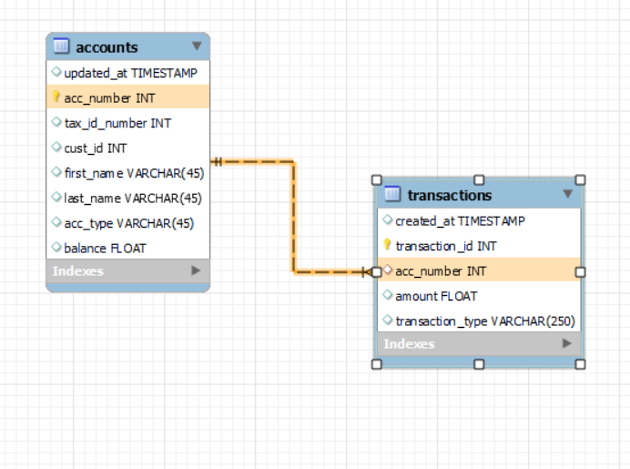

# **Internal Banking API**

## **Basic banking features including**

 
1. create account for customer or multiple accounts for same customer
2. View account details
3. Transfer between two accounts
4. Show account balance
5. Show transfer history for a given account

### **Database**

### **Framework**

1. Python –flask
2. SQL alchemy
3. Python -flask-session

### **Required**

1. Python ~3.7
2. SQL alchemy

### **How to Run**

Clone this repository

### **Isolate project development**

**Make sure you have configured pipenv**

$ pipenv shell

### **Install suitable dependencies from Pipfile.lock**

$ pipenv install

### **app launch**

$ python banking_api.py

### **go to this link on browser**

 http://127.0.0.1:8000/api/doc

